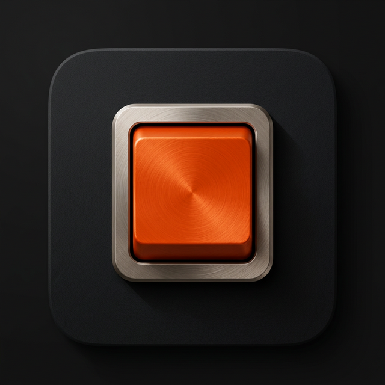

<p align="center">
  
</p>

<h1 align="center">StillSound</h1>

<p align="center">
  <strong>Auto-sync Spotify with YouTube — built for students who study with music.</strong>
</p>

<p align="center">
  <a href="https://github.com/saketjndl/StillSound-Studio/releases">Download</a> ·
  <a href="#installation">Install</a> ·
  <a href="#how-it-works">How it works</a>
</p>

---

StillSound automatically pauses your Spotify when you play a YouTube video and resumes it when you stop. No more alt-tabbing to pause your music during lectures.

## How It Works

```
┌──────────────────┐     WebSocket      ┌──────────────────┐     Spotify API     ┌──────────┐
│  Browser Ext.    │ ◄───────────────► │  StillSound App  │ ◄────────────────► │  Spotify  │
│  (Chrome)        │   localhost:9876    │  (Desktop)       │     OAuth + REST    │          │
└──────────────────┘                    └──────────────────┘                     └──────────┘
```

1. The **browser extension** detects when a YouTube video plays or pauses.
2. It sends that info to the **StillSound desktop app** over a local WebSocket.
3. The desktop app tells **Spotify** to pause or resume accordingly.

---

## Installation

### Desktop App (Windows)

1. Download the latest `.exe` installer from the [Releases](https://github.com/saketjndl/StillSound-Studio/releases) page.
2. Run the installer — choose where to install.
3. Launch **StillSound** from the Start Menu or desktop.

### Browser Extension (Chrome)

1. Open Chrome → `chrome://extensions/`
2. Enable **Developer Mode** (toggle in the top right).
3. Click **Load Unpacked** → select the `browser-extension` folder.

---

## First-Time Setup

The app walks you through setup:

1. **Spotify Client ID** — Go to [Spotify Developer Dashboard](https://developer.spotify.com/dashboard), create an app, copy the Client ID, and set the Redirect URI to `http://127.0.0.1:8921/callback`.
2. **Connect** — Click "Connect to Spotify" in the app, sign in, and approve.

That's it. Open a YouTube video and your Spotify will pause automatically.

---

## Building from Source

Requires Rust, Node.js, and MSVC Build Tools.

```bash
# Development
npm run dev

# Build installer (.exe)
npm run build
```

The installer is output to `src-tauri/target/release/bundle/nsis/`.

---

## Project Structure

```
├── src/                    # Frontend (HTML/CSS/JS)
│   ├── index.html
│   ├── styles.css
│   └── main.js
├── src-tauri/              # Rust backend
│   ├── src/lib.rs          # Sync engine
│   ├── tauri.conf.json     # App & installer config
│   └── Cargo.toml          # Dependencies
└── browser-extension/      # Chrome extension
    ├── manifest.json
    ├── background.js
    ├── content.js
    ├── popup.html
    └── popup.js
```

---

## Contributing

If StillSound helps your study sessions, consider [starring the repo](https://github.com/saketjndl/StillSound-Studio) ⭐

---

## License

MIT
